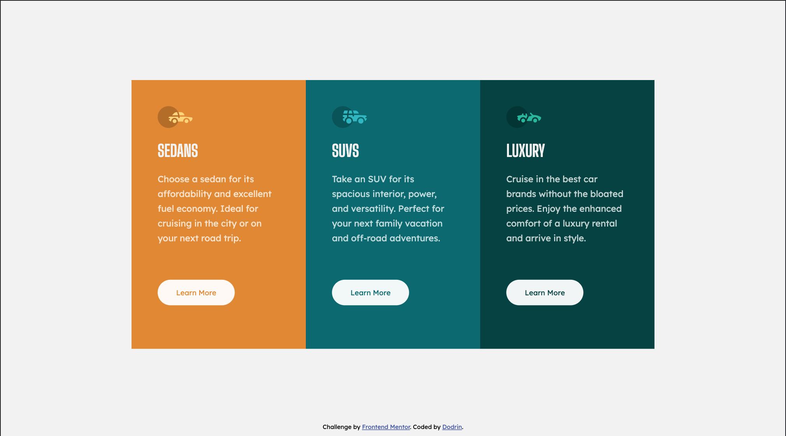

# Frontend Mentor - 3-column preview card component solution

This is a solution to the [3-column preview card component challenge on Frontend Mentor](https://www.frontendmentor.io/challenges/3column-preview-card-component-pH92eAR2-). Frontend Mentor challenges help you improve your coding skills by building realistic projects. 

## Table of contents

- [Overview](#overview)
  - [The challenge](#the-challenge)
  - [Screenshot](#screenshot)
  - [Links](#links)
- [My process](#my-process)
  - [Built with](#built-with)
  - [What I learned](#what-i-learned)
  - [Continued development](#continued-development)
  - [Useful resources](#useful-resources)
- [Author](#author)
- [Acknowledgments](#acknowledgments)

## Overview

### The challenge

Users should be able to:

- View the optimal layout depending on their device's screen size
- See hover states for interactive elements

### Screenshot

### Links

- Solution URL: [Add solution URL here](https://your-solution-url.com)
- Live Site URL: [Add live site URL here](https://your-live-site-url.com)

## My process

- added imgs to html and style the body
- written three column layout 
- style the column
- create buttons and style them 
- check the design using dev tool

### Built with

- CSS Grid

### What I learned

I learned about mix-blend-mode property that I did not know from this project. Also I used not flexbox but CSS grid for responsive design this time, that was another lerning though still I have some stuff I need to figure out.

### Useful resources

- [resource 1](https://developer.mozilla.org/en-US/docs/Web/CSS/mix-blend-mode#specifications) - This page helped me to make hover button using mix-blend-mode and learn about it.

- [resource 2](https://css-tricks.com/snippets/css/complete-guide-grid/) - I used this resource to make CSS grid layout.

- [resource 3](https://ishadeed.com/article/css-grid-minmax/)
- This resource was really helpful and easy to understand minmax() property.

## Author

- Frontend Mentor - [@dodrin](https://www.frontendmentor.io/profile/dodrin)

## Acknowledgments

This is my 3rd frontend mentor project that I have done by myself. Your feedback will always help and motivate me. I appreciate if you could give a comment on my fontend mentor post.
Cheers, happy coding!

